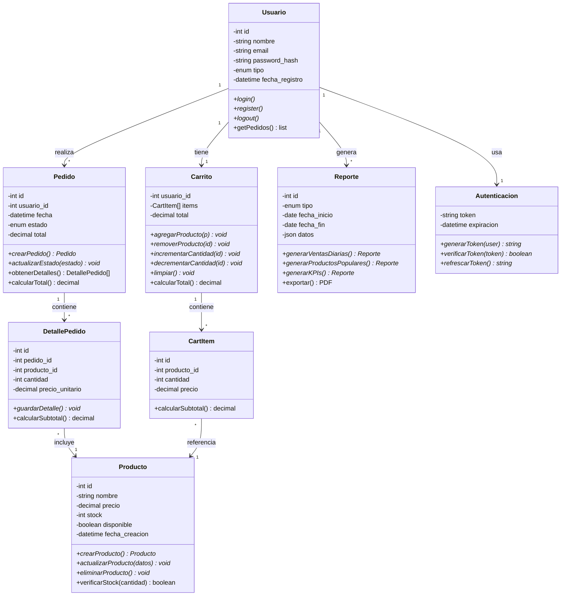
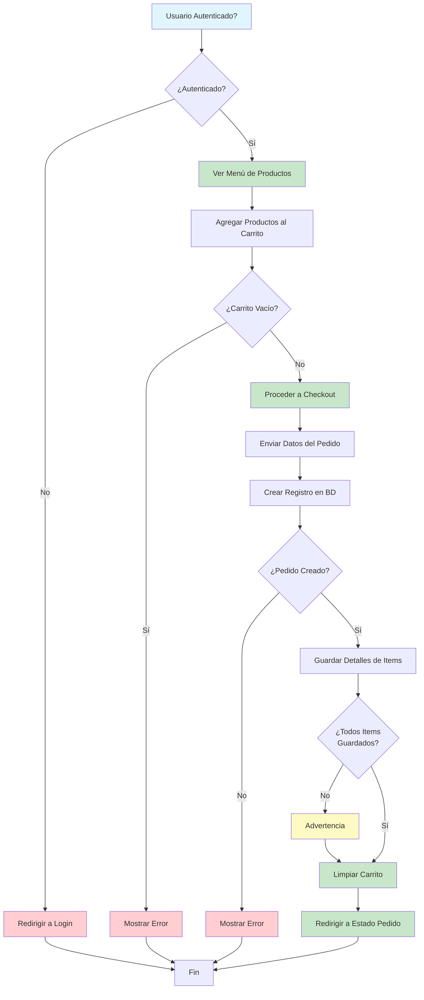
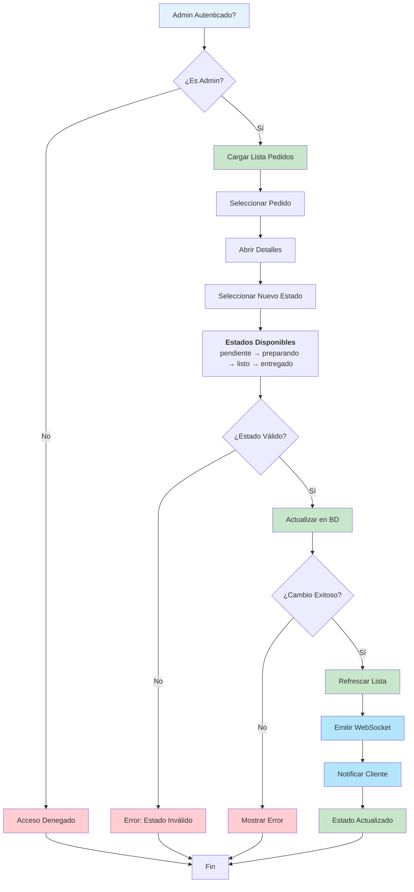
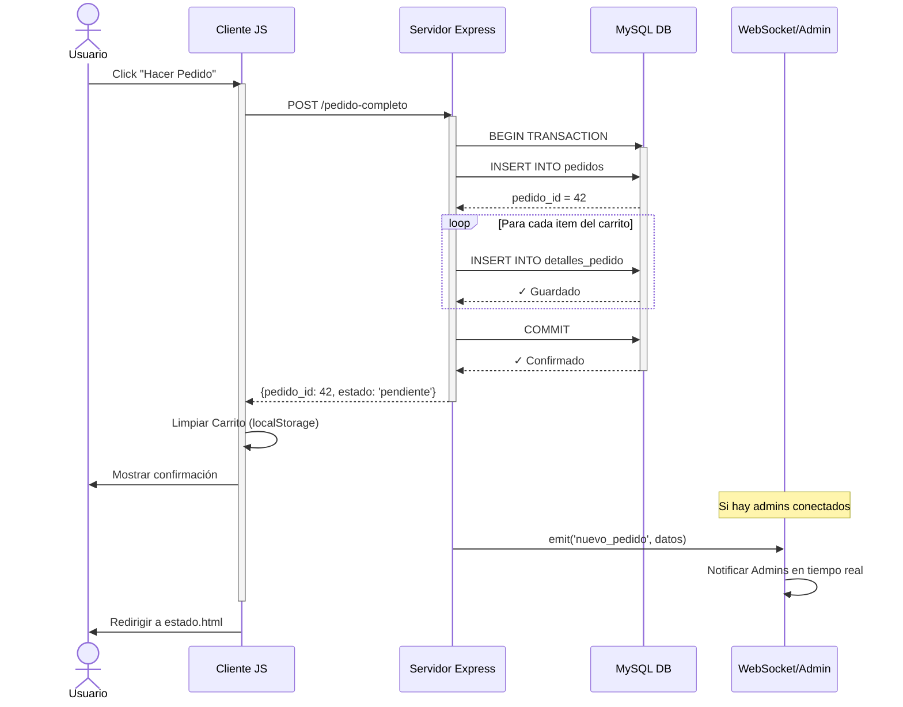
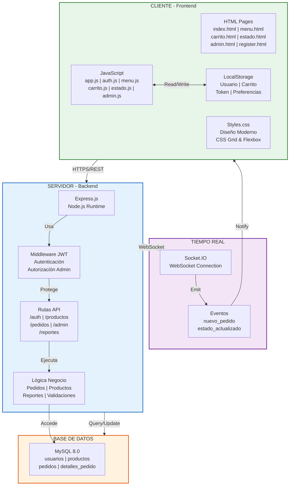
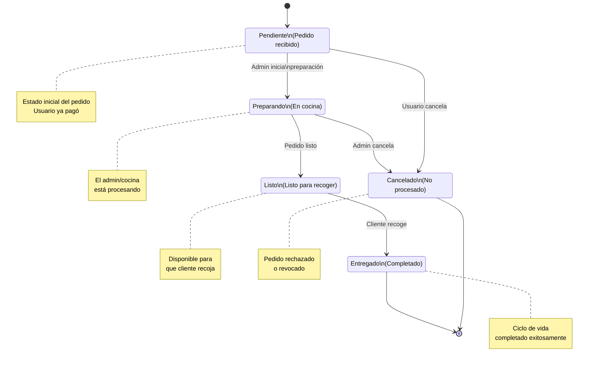
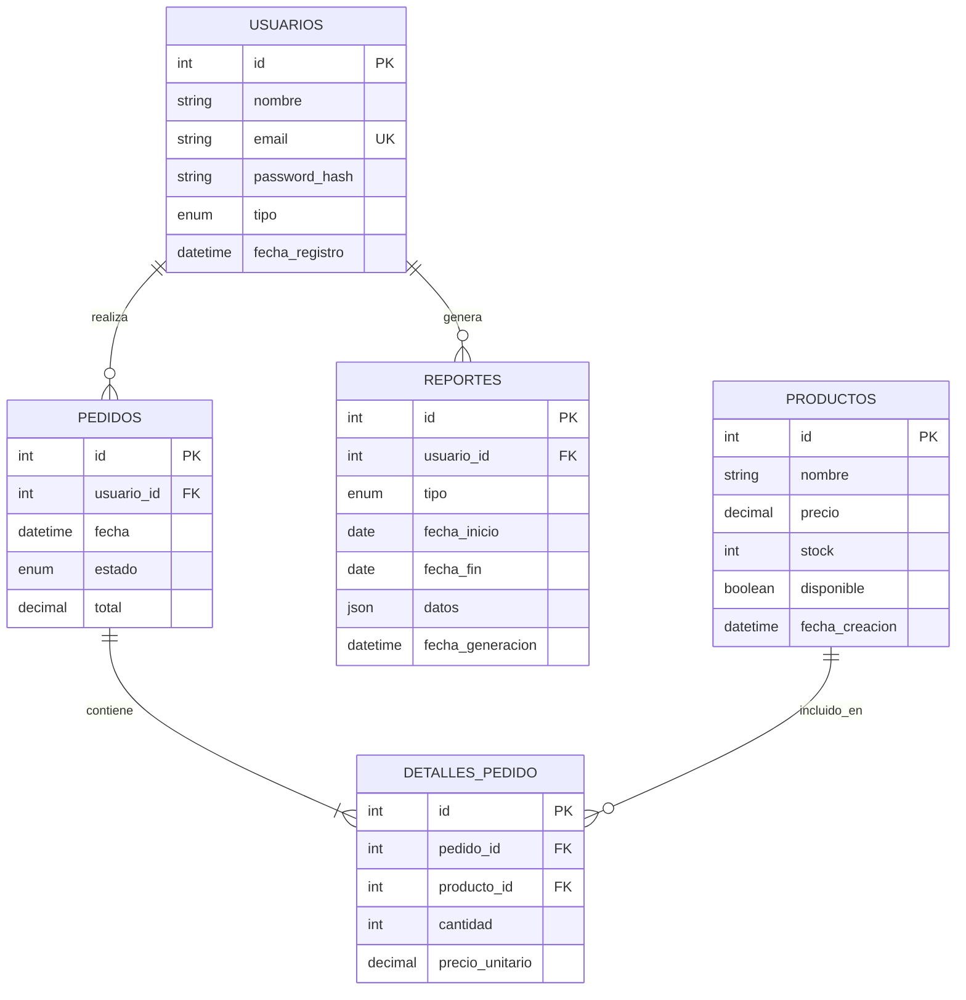
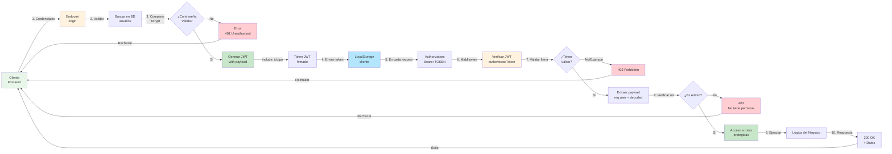

# 📊 DIAGRAMAS UML - SISTEMA CAFETERÍA

Documento con todos los diagramas UML del proyecto. Puedes exportarlos como imágenes usando:
- [Mermaid Live](https://mermaid.live)
- VS Code + Extensión "Markdown Preview Mermaid Support"
- GitHub (visualiza automáticamente)

---

## 1️⃣ DIAGRAMA DE CASOS DE USO

```mermaid
graph TB
    U["USUARIO"]
    A["ADMINISTRADOR"]
    
    subgraph Autenticación["Autenticación"]
        UC1["Registrarse"]
        UC2["Iniciar Sesión"]
    end
    
    subgraph Compra["Gestión de Compras"]
        UC3["Ver Menú"]
        UC4["Buscar Productos"]
        UC5["Agregar al Carrito"]
        UC6["Ver Carrito"]
        UC7["Modificar Cantidad"]
        UC8["Hacer Pedido"]
    end
    
    subgraph Seguimiento["Seguimiento de Pedidos"]
        UC9["Ver Estado Pedido"]
        UC10["Ver Historial Pedidos"]
    end
    
    subgraph Admin["Administración"]
        UC11["Gestionar Productos"]
        UC12["Ver Pedidos Activos"]
        UC13["Actualizar Estado Pedido"]
        UC14["Generar Reportes"]
        UC15["Consultar KPIs"]
    end
    
    U -->|realiza| UC1
    U -->|realiza| UC2
    U -->|realiza| UC3
    U -->|realiza| UC4
    U -->|realiza| UC5
    U -->|realiza| UC6
    U -->|realiza| UC7
    U -->|realiza| UC8
    U -->|realiza| UC9
    U -->|realiza| UC10
    
    A -->|realiza| UC2
    A -->|realiza| UC11
    A -->|realiza| UC12
    A -->|realiza| UC13
    A -->|realiza| UC14
    A -->|realiza| UC15
    
    UC3 -->|incluye| UC4
    UC5 -->|incluye| UC6
    UC8 -->|incluye| UC6
    UC14 -->|extiende| UC12
    UC15 -->|extiende| UC12
    
    style U fill:#e8f5e9,stroke:#2e7d32,stroke-width:3px
    style A fill:#e3f2fd,stroke:#1565c0,stroke-width:3px
    style Autenticación fill:#fff3e0,stroke:#e65100,stroke-width:2px
    style Compra fill:#f3e5f5,stroke:#6a1b9a,stroke-width:2px
    style Seguimiento fill:#fce4ec,stroke:#c2185b,stroke-width:2px
    style Admin fill:#e0f2f1,stroke:#00695c,stroke-width:2px
```



---

## 2️⃣ DIAGRAMA DE CLASES UML



---

## 3️⃣ DIAGRAMA DE FLUJO - HACER PEDIDO



---

## 4️⃣ DIAGRAMA DE FLUJO - ADMIN: ACTUALIZAR ESTADO PEDIDO



---

## 5️⃣ DIAGRAMA DE SECUENCIA - HACER PEDIDO



---

## 6️⃣ DIAGRAMA DE ARQUITECTURA - SISTEMA COMPLETO



---

## 7️⃣ DIAGRAMA DE ESTADOS - CICLO DE VIDA DEL PEDIDO



---

## 8️⃣ DIAGRAMA ENTIDAD-RELACIÓN (ER) - BASE DE DATOS



---

## 9️⃣ DIAGRAMA DE AUTENTICACIÓN Y AUTORIZACIÓN JWT



---

## 📋 TABLA RESUMEN

| # | Diagrama | Tipo | Uso |
|---|----------|------|-----|
| 1 | Casos de Uso | UML Use Case | Funcionalidades y actores |
| 2 | Clases | UML Class | Estructura OOP |
| 3 | Flujo Pedido | Flowchart | Proceso de compra |
| 4 | Flujo Admin | Flowchart | Gestión de pedidos |
| 5 | Secuencia | UML Sequence | Interacción paso a paso |
| 6 | Arquitectura | Graph | Componentes del sistema |
| 7 | Estados Pedido | State Machine | Ciclo de vida |
| 8 | Base de Datos | ER Diagram | Relaciones BD |
| 9 | Autenticación | Flowchart | Seguridad JWT |

---

## 🚀 CÓMO EXPORTAR

### **Opción A: Desde GitHub**
- Sube este archivo a tu repositorio
- Los diagramas se renderizan automáticamente en README

### **Opción B: Desde Mermaid Live**
1. Copia un diagrama (bloque ` ```mermaid ` `)
2. Pega en https://mermaid.live
3. Click botón descargar → PNG/SVG

### **Opción C: Desde VS Code**
1. Instala extensión: "Markdown Preview Mermaid Support"
2. Abre este archivo
3. Ctrl+Shift+V para Preview
4. Click derecho → Save as PNG

### **Opción D: CLI (Mermaid CLI)**
```bash
npm install -g @mermaid-js/mermaid-cli
mmdc -i DIAGRAMAS_UML.md -o diagramas_exportados/
```

---

**Última actualización**: 28 de Abril de 2026
