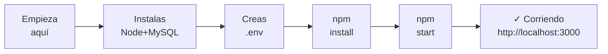

#  CONTENIDO DE LA CARPETA REQUERIMIENTOS

Guía visual de todos los documentos disponibles.

---

##  Vista Rápida

| Archivo | Tiempo Lectura | Para Quién | Acción |
|---------|-----------------|-------|-----------|--------|
|  **COMO_EJECUTAR.md** | 15 min  | Todos | **EMPIEZA AQUÍ** |
|  **RESUMEN_EJECUTIVO.md** | 5 min | Directivos | Entiende QUÉ |
|  **README.md** | 10 min  | Desarrolladores | Documentación oficial |
|  **ESTRUCTURA.md** | 20 min  | Arquitectos | Entiende CÓMO |
|  **DEPENDENCIAS.md** | 15 min  | DevOps | Qué usa cada cosa |
|  **FAQ.md** | 10 min  | Todos | Preguntas comunes |
|  **GLOSARIO.md** | 20 min  | Estudiantes | Aprende términos |
|  **ROADMAP.md** | 15 min  | Planificadores | Mejoras futuras |
|  **INDICE.md** | 3 min  | Todos | **Navegación** |
|  **.env.example** | 2 min  | Configuradores | Ejemplo de config |

**Total**: ~95 minutos de documentación (combinada)

---

##  Matriz de Selección

```
¿TIENES PRISA?           → COMO_EJECUTAR.md (15 min)
¿ERES JEFE/PROFESOR?     → RESUMEN_EJECUTIVO.md (5 min)
¿VAS A PROGRAMAR?        → README.md + ESTRUCTURA.md (30 min)
¿NECESITAS REFERENCIA?   → Usa Ctrl+F en ESTRUCTURA.md
¿NO ENTIENDE UN TÉRMINO? → GLOSARIO.md
¿TIENES PREGUNTA FAC?    → FAQ.md
¿PLANIFICADOR?           → ROADMAP.md
¿PERDIDO?                → INDICE.md
```

---

##  Descripción Detallada

###  **COMO_EJECUTAR.md**
```
Descripción: Pasos exactos para tener el proyecto corriendo
Contenido: 
  • Instalar Node.js + MySQL
  • Crear BD y tablas
  • Configurar .env
  • npm install
  • npm start
  • Probar en navegador
  • Datos de prueba
  • Troubleshooting

Cuándo: Cuando quieres tener algo funcionando YA
Cuánto: 15 minutos ejecutar
```

---

###  **RESUMEN_EJECUTIVO.md**
```
Descripción: Explicación alto nivel del proyecto
Contenido:
  • Qué es Cafetería U (en 1 frase)
  • Para qué sirve
  • Dos tipos de usuarios
  • Stack tecnológico
  • Requisitos mínimos
  • Características principales
  • Flujo básico
  • Checklist

Cuándo: Para no-técnicos o rápida comprensión
Cuánto: 5 minutos leer
Nivel: Principiante
```

---

###  **README.md**
```
Descripción: Documentación oficial completa
Contenido:
  • Descripción extendida
  • Pasos instalación detallados
  • URLs de acceso
  • Estructura carpetas
  • Tecnologías usadas
  • Características seguridad
  • Variables de entorno
  • Troubleshooting general
  • Flujo de uso

Cuándo: Referencia oficial, después de ejecutar
Cuánto: 10 minutos leer
Nivel: Intermedio
```

---

###  **ESTRUCTURA.md**
```
Descripción: Arquitectura técnica detallada
Contenido:
  • Diagrama Cliente-Servidor-BD
  • Esquema completo BD (tablas, campos)
  • API REST endpoints (todos los 20+)
  • Autenticación JWT explicada
  • WebSockets y tiempo real
  • Flujos de negocio (paso a paso)
  • Seguridad implementada
  • Escalabilidad notas

Cuándo: Vas a modificar código o aprender internals
Cuánto: 20 minutos leer
Nivel: Avanzado
Uso: Referencia mientras desarrollas
```

---

###  **DEPENDENCIAS.md**
```
Descripción: Cada librería NPM explicada
Contenido:
  • Express (qué es, ejemplos)
  • MySQL2 (cómo se usa)
  • CORS (para qué)
  • Bcrypt (hasheo seguro)
  • JWT (tokenización)
  • Socket.io (tiempo real)
  • Dotenv (configuración)
  • Versiones y compatibilidad
  • Cómo instalar
  • Auditoría de seguridad

Cuándo: Quieres saber qué hace cada dependencia
Cuánto: 15 minutos leer
Nivel: Avanzado (técnico)
Uso: Referencia al usar npm
```

---

###  **FAQ.md**
```
Descripción: Preguntas más frecuentes respondidas
Contenido:
  • General (qué es, para quién)
  • Instalación (cómo instalar)
  • Base de datos (MySQL específico)
  • Autenticación (JWT, passwords)
  • Desarrollo (agregar features)
  • Frontend (cambiar UI)
  • Funcionalidad (cómo, qué)
  • WebSockets (tiempo real)
  • Performance (optimización)
  • Errores comunes (soluciones)
  • Despliegue (producción)
  • Mantenimiento (updates)

Cuándo: Tienes una pregunta específica
Cuánto: 5-10 min por pregunta
Nivel: Mixto
Uso: Busca tu pregunta (Ctrl+F)
```

---

###  **GLOSARIO.md**
```
Descripción: Diccionario de términos técnicos
Contenido:
  • 100+ términos definidos
  • API, Async/Await, Bcrypt...
  • Abreviaturas (JWT, REST, CORS...)
  • Símbolos técnicos
  • HTTP status codes
  • Ejemplos de código para cada

Cuándo: No entiendes un término técnico
Cuánto: 1-2 min por término
Nivel: Estudiante/Principiante
Uso: Referencia rápida
```

---

###  **ROADMAP.md**
```
Descripción: Futuro del proyecto
Contenido:
  • Estado actual v1.0
  • Limitaciones actuales
  • Phase 1: Seguridad
  • Phase 2: Features nuevos
  • Phase 3: UX improvements
  • Phase 4: Analytics
  • Phase 5: Escalado
  • Mejoras UI/UX
  • Mantenimiento continuo
  • Estimación costos
  • Timeline recomendado
  • Qué NO hacer

Cuándo: Planificas mejoras o eres gestor proyecto
Cuánto: 15 minutos leer
Nivel: Gestor/Arquitecto
Uso: Planificación estratégica
```

---

###  **INDICE.md**
```
Descripción: Tu estás aquí - navegación
Contenido:
  • Este archivo que lees
  • Rutas rápidas por objetivo
  • Descripción de cada archivo
  • Matriz búsqueda (quién lee qué)
  • Tiempos estimados
  • Checklist de lectura

Cuándo: Estás perdido o quieres navegar
Cuánto: 3 minutos
Nivel: Todos
Uso: Mapa del proyecto
```

---

###  **.env.example**
```
Descripción: Plantilla de configuración
Contenido:
  • Ejemplo de archivo .env
  • Cada variable explicada
  • Valores por defecto
  • Configuración desarrollo vs producción
  • Cómo generar JWT_SECRET

Cuándo: Necesitas crear archivo .env
Cuánto: 2 minutos
Nivel: Principiante
Uso: Cópialo a .env y edita
```

---

##  Trayectorias de Aprendizaje Recomendadas

### Trayectoria 1: Ejecutar (20 minutos)


### Trayectoria 2: Aprender Arquitectura (1 hora)
```
RESUMEN_EJECUTIVO.md (entiende QUÉ)
    ↓
README.md (documentación oficial)
    ↓
ESTRUCTURA.md (arquitectura técnica)
    ↓
DEPENDENCIAS.md (qué usa cada cosa)
```

### Trayectoria 3: Resolver Problemas (variable)
```
¿Pregunta técnica? → FAQ.md
    ↓
¿No encuentras? → Buscar en ESTRUCTURA.md
    ↓
¿Término desconocido? → GLOSARIO.md
    ↓
¿Seguido sin solución? → Revisar error en ROADMAP.md
```

### Trayectoria 4: Mejorar el Proyecto (1-2 horas)
```
Entiendes estado actual
    ↓
Lees ROADMAP.md
    ↓
Seleccionas mejora deseada
    ↓
Estudias ESTRUCTURA.md sección relevante
    ↓
Implementas cambio
    ↓
Actualizas ESTRUCTURA.md con tus cambios
```

---

##  Estadísticas de Contenido

| Métrica | Valor |
|---------|-------|
| Total de archivos | 10 |
| Palabras totales | ~18,000 |
| Líneas de código | 250+ |
| Tablas y diagramas | 20+ |
| Ejemplos prácticos | 40+ |
| Secciones | 150+ |
| Enlaces internos | 100+ |
| Tiempo lectura total | 95 minutos |
| Términos glosario | 100+ |
| APIs documentadas | 20+ |

---

##  Estructura de Archivos

```
REQUERIMIENTOS/
│
├──  DOCUMENTACIÓN OFICIAL
│   ├── README.md                  (Documentación completa)
│   ├── RESUMEN_EJECUTIVO.md       (Visión ejecutiva)
│   └── COMO_EJECUTAR.md           (Guía paso a paso)
│
├──  TÉCNICO
│   ├── ESTRUCTURA.md              (Arquitectura detallada)
│   ├── DEPENDENCIAS.md            (Librerías explicadas)
│   └── .env.example               (Configuración)
│
├──  REFERENCIAS
│   ├── GLOSARIO.md                (Diccionario términos)
│   ├── FAQ.md                     (Preguntas frecuentes)
│   └── INDICE.md                  (Este archivo)
│
└──  ESTRATEGIA
    └── ROADMAP.md                 (Mejoras futuras)
```

---

## 🔍 Búsqueda Rápida por Tópico

| Tópico | Archivos |
|--------|----------|
| **Instalar** | COMO_EJECUTAR.md |
| **Usar API** | ESTRUCTURA.md |
| **Cambiar color** | FAQ.md → Frontend |
| **Agregar feature** | ROADMAP.md |
| **Entender JWT** | ESTRUCTURA.md + FAQ.md |
| **Seguridad** | ESTRUCTURA.md (sección) |
| **Performance** | ROADMAP.md (Phase 5) |
| **Términos técnicos** | GLOSARIO.md |
| **Errores** | FAQ.md (Troubleshooting) |
| **Para presentación** | RESUMEN_EJECUTIVO.md |
| **Para desarrollador** | ESTRUCTURA.md |
| **Para QA/Tester** | COMO_EJECUTAR.md |

---

##  Checklist de Comprensión

- [ ] Leí RESUMEN_EJECUTIVO.md (5 min)
- [ ] Ejecuté COMO_EJECUTAR.md (15 min)
- [ ] Abrí el proyecto en navegador
- [ ] Leí README.md para referencia (10 min)
- [ ] Entendi ESTRUCTURA.md (20 min)
- [ ] Tengo acceso a DEPENDENCIAS.md (si necesito)
- [ ] Sé dónde encontrar FAQ.md (si duda)
- [ ] Revisé GLOSARIO.md (si término desconocido)
- [ ] Sé que existe ROADMAP.md (para mejoras)
- [ ] Entiendo la navegación de INDICE.md


---

##  Recomendación Final

**Antes de hacer cualquier cosa**:
1. Lee RESUMEN_EJECUTIVO.md (5 min)
2. Ejecuta COMO_EJECUTAR.md (15 min)
3. Abre http://localhost:3000
4. Explora la interfaz (10 min)
5. Luego lee lo que necesites específicamente

**No tienes que leer todo**. Lee solo lo que necesitas para tu rol:

- **Usar la app**: COMO_EJECUTAR.md + FAQ.md
- **Modificar código**: README.md + ESTRUCTURA.md
- **Administrar servidor**: DEPENDENCIAS.md + ROADMAP.md


---

##  Próximos Pasos

1. **Abre** `COMO_EJECUTAR.md` (si no lo hiciste)
2. **Sigue** los 5 pasos de instalación
3. **Abre** navegador en `http://localhost:3000`
4. **Explora** la aplicación (registra, pide algo)
5. **Vuelve** a esta documentación si tienes duda

---

**¡Felicidades!**   
Ya estás en la carpeta de requerimientos. 
Todos los documentos están aquí listos para ti.

---

**Versión**: 1.0  
**Última actualización**: 2024  
**Status**:  Completo y Navegable

**¿LISTO?** → Abre `COMO_EJECUTAR.md` 
